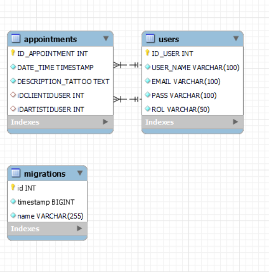

# Welcome to my backend app

## king_tattoo


<details>
  <summary>Contenido 📝</summary>
  <ol>
    <li><a href="#objetivo">Objetivo</a></li>
    <li><a href="#sobre-el-proyecto">Sobre el proyecto</a></li>
    <li><a href="#stack">Stack</a></li>
    <li><a href="#diagrama-bd">Diagrama</a></li>
    <li><a href="#instalación-en-local">Instalación</a></li>
    <li><a href="#endpoints">Endpoints</a></li>
    <li><a href="#futuras-funcionalidades">Futuras funcionalidades</a></li>
    <li><a href="#contribuciones">Contribuciones</a></li>
    <li><a href="#licencia">Licencia</a></li>
    <li><a href="#webgrafia">Webgrafia</a></li>
    <li><a href="#agradecimientos">Agradecimientos</a></li>
    <li><a href="#contacto">Contacto</a></li>
  </ol>
</details>

## Objetivo
Este proyecto requería una API funcional conectada a una base de datos 

## Sobre el proyecto
He decidido crear una API funcional conectada a la base de datos de un estudio de tatuajes. Esta aplicación está orientada al sistema de gestión de citas y perfiles de usuarios de tal estudio; en ella se distinguen dos entidades principales: las citas y los usuarios, los usuarios se dividen en dos roles: clientes y artistas, y en correspondencia con el rol de cada cual, podrán acceder a la información de sus respectivas citas. Las citas podrán ser modificadas y eliminadas. Los usuarios podrán registrarse, loguearse, y acceder a sus datos de perfil. El perfil de los usuarios podrá ser modificado. Además, en la web se podrá acceder a la lista de artistas disponibles para poder elegir con cuál de ellos el cliente desea hacerse el tatuaje.


## Stack
Tecnologías utilizadas:
<div align="center">
<a href="https://www.mysql.com/">
    
</a>
<a href="https://www.expressjs.com/">
    
</a>
<a href="https://nodejs.org/es/">
    
</a>
<a href="https://developer.mozilla.org/es/docs/Web/JavaScript">
    
</a>
 </div>


## Diagrama BD


## Instalación en local
1. Clonar el repositorio
2. ` $ npm install `
3. Conectamos nuestro repositorio con la base de datos 
4. ``` $ Ejecutamos las migraciones ``` 
5. ``` $ npm run dev ``` 


## Endpoints
<details>
<summary>Endpoints</summary>

http://localhost:3000

    - REGISTER USER

            POST /register
        body:
        ``` js
           {
            "USER_NAME" : "Juan",
            "EMAIL": "juan@email.com",
            "PASS": "123456",
            "ROL": "artist"
           }
        ```

    - LOGIN USER

            POST /login  
        body:
        ``` js
            {
                "email": "manolo@email.com",
                "password":"123456"
            }
        ```

        - GET ALL USERS 

            GET /users  


    - USER PROFILE 

            GET /userId/1   

       
    - UPDATE USERS PROFILE 

            PATCH /modifyProfile/1    
        body:
        ``` js
             {
              "USER_NAME" : "Newramiro",
              "EMAIL": "newmanolo@email.com",  
            }
        ```
    
    - GET ARTISTS

            GET /artists  

    - APPOINTMENT CREATION

            POST /createAppointment
        body:
        ``` js
            {
                
                  "DATE_TIME": "2024-06-18 10:30:00",
                  "DESCRIPTION_TATTOO": "Tattoo rosa y verde",
                  "ID_CLIENT": 4,
                  "ID_ARTIST": 5

            }
        ```
    - GET ALL APPOINTMENTS

            GET /getAppointments

   - GET APPOINTMENTS BY ID

            GET /getAppointmentById/3         

        
    - APPOINTMENT UPDATE

            PATCH /modifyAppointment/2
        body:
        ``` js
            {
                
                  "DATE_TIME": "2024-02-14 18:00:00",
                  "DESCRIPTION_TATTOO": "Tattoo black and green"

            }
        ```
     - APPOINTMENT DELETE

            DELETE /deleteAppointment/3

     - CLIENT APPOINTMENT

            GET /getAppointmentByClient/1

     - ARTIST APPOINTMENT

            GET /getAppointmentByArtist/2  
 


    - ...
</details>

## Futuras funcionalidades
[ ] Añadir admin, superadmin 
[ ] Vizualizar Diseño de tattoo
 

## Contribuciones
Las sugerencias y aportaciones son siempre bienvenidas.  

Puedes hacerlo de dos maneras:

1. Abriendo una issue
2. Crea un fork del repositorio
    - Crea una nueva rama  
        ```
        $ git checkout -b feature/nombreUsuario-mejora
        ```
    - Haz un commit con tus cambios 
        ```
        $ git commit -m 'feat: mejora X cosa'
        ```
    - Haz push a la rama 
        ```
        $ git push origin feature/nombreUsuario-mejora
        ```
    - Abre una solicitud de Pull Request

## Licencia
Este proyecto se encuentra bajo licencia de "Dayanis"

## Webgrafia:
Para conseguir mi objetivo he recopilado información de:
- https://www.npmjs.com/package//typeorm


## Agradecimientos:

Agradezco a mi tutor Aissa, a mis profesores del Bootcamp y a mis compañeros por toda la ayuda en este proyecto:

- *Erika*  
<a href="https://github.com/AkireOrl/" target="_blank"></a> 

- *Reynaldo*  
<a href="https://github.com/ReynaldoMunozF/" target="_blank"></a> 

 

## Contacto
<a href = "mailto:garciarodriguezprof@gmail.com"> Email</a>

</p>